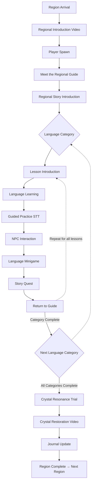

# Universal Region Gameplay Architecture

## Objective
This document defines the single reusable gameplay blueprint that every region in LUMINANG follows. It establishes how the game fundamentally works without specifying region-specific content. This architecture is designed for a low-poly 3D adventure game, heavily emphasizing exploration, storytelling, NPC interaction, and integrated language learning.

---

## 1. Universal Gameplay Flow

The core loop for every region follows this structured sequence:

---

## 2. Core Gameplay Principles

Every region in LUMINANG must adhere to the following principles:
- **Encourage Exploration:** The environment should be large enough to wander and discover secrets.
- **Environmental Gameplay:** Utilize the physical space as part of the puzzle or progression (e.g., finding items, locating specific landmarks).
- **Physical Travel:** Players must physically travel between objectives, promoting immersion rather than relying heavily on fast-travel UI.
- **NPC Reusability:** Existing NPCs should be reused for interactions, avoiding excessive asset bloat.
- **Natural Language Learning:** Language concepts should be taught within the context of the story or setting.
- **No Quiz Fatigue:** Avoid making lessons feel like sterile quizzes. They should feel like natural conversations or fun challenges.
- **Visual Progression:** Reinforce progression by visually restoring the world through crystal restoration.
- **Structural Consistency:** Maintain the exact same gameplay structure across all regions to set clear player expectations.

---

## 3. Universal Systems Definition

### 3.1 Region Progression
- **Entry:** Triggered via the Map Selection scene. Upon entering, the regional cinematic plays.
- **Main Hub:** The Regional Guide serves as the central anchor point for the region, directing the player to categories and trials.
- **Exit:** Once the final crystal is restored, the player's journal is updated, and they unlock access to the next region.

### 3.2 Language Categories
- Languages are broken down into thematic categories (e.g., Greetings, Food, Directions).
- Categories must be completed sequentially to ensure a logical learning curve.

### 3.3 Lesson Progression
- **Lesson Introduction:** The Regional Guide introduces the context of the lesson.
- **Language Learning:** Introduction of specific vocabulary/phrases via UI and audio.
- **Guided Practice (STT):** The player uses the Speech-to-Text engine to practice pronunciation in a low-pressure environment.

### 3.4 NPC Conversation Flow
- **Interactive Application:** The player must find a specific NPC in the environment and use the newly learned phrase in a real conversation.
- Branching dialogues will guide the player back if they choose the wrong response, ensuring positive reinforcement.

### 3.5 Story Quest Flow
- **Contextual Objectives:** NPCs assign small quests (e.g., delivering an item, finding a location) that require the player to understand the language they just learned.
- Relies on the `ObjectiveManager` to update UI and guide the player.

### 3.6 Minigame Flow
- **Skill Reinforcement:** After the quest, the player engages in a minigame (Matching, Word Rush) to reinforce memory.
- Minigames use a standardized asset cache but pull dynamic vocabulary based on the current lesson category.

### 3.7 Crystal Progression & Crystal Resonance Trial
- **The Trial:** The climax of the region. A multi-phase challenge testing all categories learned in the region.
- **Restoration:** Successfully completing the trial triggers the "Crystal Restoration" cinematic, bringing light/color back to the region or specific landmarks.

### 3.8 Journal Progression
- **Documentation:** Automatically updates as the player completes lessons and restores crystals, acting as an in-game dictionary and lore book.
